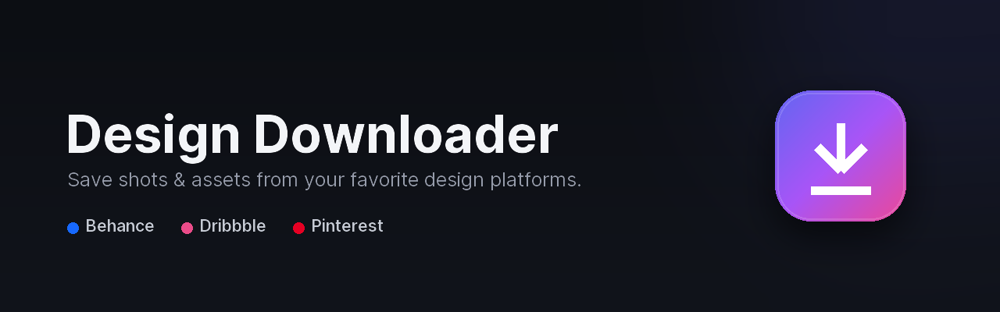
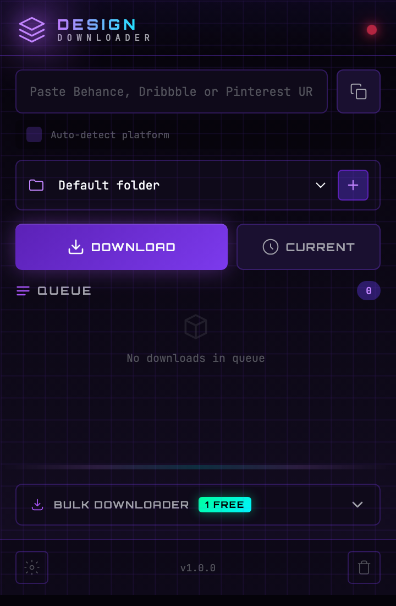

<p align="center">
  
</p>

<h1 align="center">Design Downloader</h1>

<p align="center">
  Download designs, shots and assets from <b>Behance</b>, <b>Dribbble</b> and <b>Pinterest</b> —
  with a desktop app, a local API server, and a Chrome extension.
</p>

<p align="center">
  
  
  
  
</p>

---

## ✨ Features

- **3 platforms, one tool** — Behance galleries, Dribbble shots, and Pinterest pins/boards.
- **Three ways to use it:**
  - 🖥️ **Desktop app** (`main_app.py`) — a native [CustomTkinter](https://github.com/TomSchimansky/CustomTkinter) GUI with a download queue.
  - 🌐 **Local API server** (`server.py`) — a small Flask backend exposing a download API on `http://localhost:5200`.
  - 🧩 **Chrome extension** (`extension/`) — download the page you're on, or paste a URL, straight from the toolbar.
- **Download queue** with live progress.
- **AI-assisted folder organization** to keep your downloads tidy.
- **No API keys, no account, no telemetry** — it works straight out of the box.

## 📸 Screenshot

<p align="center">
  
</p>

<p align="center"><i>The Chrome extension popup — paste a Behance / Dribbble / Pinterest URL, pick a folder, and download.</i></p>

## 📦 Requirements

- Python 3.9+
- Google Chrome 88+ (for the extension)
- The Python packages in [`requirements.txt`](requirements.txt)

```bash
pip install -r requirements.txt
```

## 🔑 API Keys

**None required.** Design Downloader does not use any paid API or secret key — it reads
publicly available pages. There is nothing to configure before running it.

> If you fork this project and later add a service that *does* need a key (e.g. a hosted
> AI model for folder naming), keep it in a local `.env` file and never commit it.

## 🚀 Quick Start

### Option 1 — Desktop app

```bash
python main_app.py
```

A window opens with a search bar, URL input and a download queue. Files are saved to
`~/Downloads/DesignDownloads`.

### Option 2 — Server + Chrome extension

```bash
# 1. Start the backend
python server.py          # runs on http://localhost:5200

# 2. Load the extension
#    - Open chrome://extensions/
#    - Enable "Developer mode" (top-right)
#    - Click "Load unpacked" and select the  extension/  folder
```

Then either:
- Click the toolbar icon, paste a Behance / Dribbble / Pinterest URL, and hit **Download**, or
- Right-click any design page → **Download with Design Downloader**, or
- Open the popup on a design page and click **Current Page**.

See [`EXTENSION_GUIDE.md`](EXTENSION_GUIDE.md) for testing tips and Chrome Web Store packaging.

## 🔌 API Endpoints

The local server (`server.py`) exposes:

| Method | Endpoint            | Description                  |
|--------|---------------------|------------------------------|
| GET    | `/api/status`       | Server status                |
| POST   | `/api/detect`       | Detect the platform of a URL |
| POST   | `/api/download`     | Add a URL to the queue       |
| GET    | `/api/downloads`    | List all downloads           |
| GET    | `/api/download/:id` | Single download status       |
| POST   | `/api/search`       | Search a platform            |
| POST   | `/api/clear`        | Clear finished downloads     |

## 🗂️ Project Structure

```
design-downloader/
├── main_app.py            # Desktop app (CustomTkinter)
├── server.py              # Flask API backend for the extension
├── behance_downloader.py  # Behance scraping logic
├── dribbble_downloader.py # Dribbble scraping logic
├── extension/             # Chrome extension (Manifest V3)
│   ├── manifest.json
│   ├── popup.html / popup.js / popup.css
│   ├── background.js
│   └── icons/
├── requirements.txt
└── EXTENSION_GUIDE.md
```

## ⚖️ Legal & responsible use

This tool is intended for downloading content **you own or are licensed to use**, and for
personal archiving. Respect each platform's Terms of Service and the original creators'
copyright. You are responsible for how you use it.

## 🤝 Contributing

Issues and pull requests are welcome. If a target site changes its markup and a downloader
breaks, that's the most useful kind of fix to send.

## 📄 License

[MIT](LICENSE) © 2026 mcanince2
